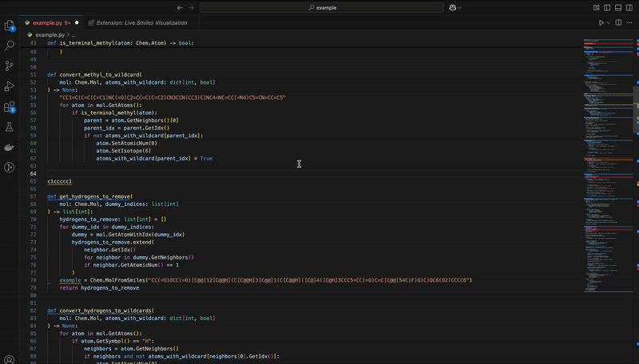

# Smiles Visualization

This extension is a work in progress and only works because of the great work Greg Landrum and others have put into RDKit. 

## Features

Hovering over SMILES strings will open a molecule viewer in a new panel and display a rendered molecule.
So far only organic molecules are supported.
This is a beta. Please do not sue me.

